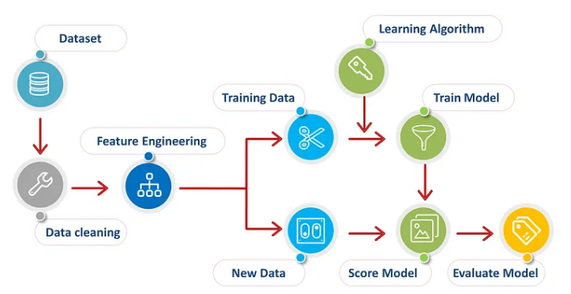
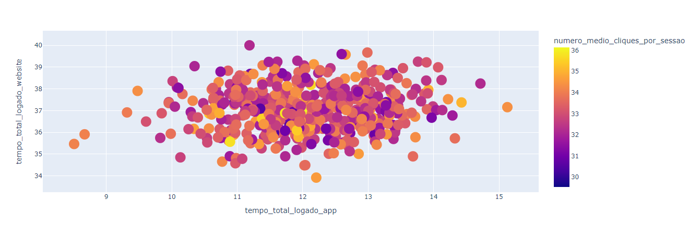

# Improve the customer experience on the app in an E-commerce

# Promoters Project

The following context is entirely fictional, the company, the context and the CEO. The business questions are also fictional, but have been worded to be an example of how they would be asked in a business work environment.

# Introduction
This is a data science regression project for a company called ClickSpeed that wants to improved the customers the customer experience.

### Solution Planning

* [1. Description and Business Problem ](#1-description-and-business-problem)
* [2. Solution Strategy ](#3-solution-strategy)
* [3. Top Insights ](#4-top-insights)
* [4. Machine Learning Model Selection and Performance](#5-machine-learning-model-selection-and-performance)
* [5. Business Results](#6-business-results)
* [6. Conclusion](#8-conclusion)
* [7. Leassons Learned](#9-leassons-learned)
* [8. Future Work and Next Steps](#10-future-work-and-next-steps)
* [8. Thanks](#10-future-work-and-next-steps)

## 1 Description and Business Problem
## 1.1 Description and context
The ClickSpeed company is a electronics company that sells first line products of various brands at a fair price through e-commerce.

The company would like to increase sales, but the budget allows you to invest only in the web site or the app at this time. 

Based on this goal, the company to improve the customer experience while browsing the system, but which system choose web site or app?. The data team was asked to select the system using data manipulation and machine learning techniques.

## 1.2 The Challenge and Business Problem

The biggest challenge, then, is to determine which customers are eligible to participate in the "Promoters" groups. In possession of this list, the marketing team will run a series of personalized and exclusive promotions for the group to increase sales and purchase frequency, as well as customer satisfaction with the company.

In addition to the creation of this group of Promoters, some business questions must be answered, they are:
* Who are the People Promoters?
* Relationship Between Time on the Website and Amount Spent?
* Relationship Between Time on the app and Amount Spent?
* Relationship Between Time on the app and registration time?
* Relationship Between Registration Time and Amount Spent?
* Relationship Between Time Logged in the App and Time Logged in the Web Site?

# 2. Solution Strategy
### Step 01. Data Description
In this step, some aspects of the data set were checked, such as: Column names, dimensions, data types, verification and completion of missing data (NA), descriptive analysis of the data and what categorical variables exist.

### Step 02. Filtering Variables
Consideration of the need to filter the dataset based on a variable that is not relevant to the project itself. In this step, some previously established business assumptions are considered.

### Step 03. Featuring Engineering
In the Featuring Engineering, new attributes (columns) were derived based on the original variables, which allow for a better description of the phenomenon of the respective variable.

### Step 04. Exploratory Data Analysis (EDA) 
Exploration of the data to find insights for a better understanding of the company business. 

### Step 05. Data Preparation & Feature Selection
This session is about preparing the data and selecting the best features so that the machine learning algorithms can be applied efficiently.

### Step 06. Pre-Processing Data for Building Machine Learning Models

### Step 07. Model Training
Creating the selected machine learning model and measuring its performance based on the RMSE, MAE and MSE metrics.

### Step 08.  Regression Analysis
Three regression models.

### Step 09. Post Profile Data Analysis
business hypothesis creation and hypothesis validation and then answering the business questions that were asked at the beginning of the project and what system choose.

# 3. Top Insights

### H1. The total amount spent monthly tends to increase if the customer spends more time logged into the app.

***TRUE*** - The Promotrs group is responsible for 49.93% of the company's total revenue.

# 4. Machine Learning Model Selection and Performance
The following regression models were applied in the project:
* Linear.
* Redge.
* Lasso.

# 5. Business Results

## 5.1 Business Questions and Answers

### Q1. Who are the People Promoters?
R: Customers who have been using the APP for over a year.

### Q2. Relationship Between Time on the Website and Amount Spent?
R: There does not appear to be a correlation between the time logged into the website and the amount spent by customers.

### Q3. Relationship Between Time on the app and Amount Spent?
R: The data has a moderate positive correlation. We can deduce that the total amount spent monthly tends to increase if the customer spends more time logged into the app.

### Q4. Relationship Between Time on the app and registration time?
R: There is no clear correlation. We can deduce that there are many customers who have been members for 3-4 years and spend approximately 11.5-12.5 minutes on the app.

### Q5. Relationship Between Registration Time and Amount Spent?
R: as the customer becomes older (longer sign-up time), the total amount spent by customers also increases.

### Q6. Relationship Between Time Logged in the App and Time Logged in the Web Site?
R: A critical problem was not detected

## 5.2 Metabase Dashboard with some information about average number of clicks per session of the total time logged into the website and total time logged into the app .

# 6. Conclusion
* Keeping all other features fixed, an increase of 1 unit in customer registration time is associated with an increase of BRL 63.74 in the total amount spent per customer per month.

* Holding all other features fixed, a 1 unit increase in the average number of clicks per session is associated with a $26.24 increase in the total amount spent per customer per month.

* Keeping all other features fixed, an increase of 1 unit in total time logged into the app is associated with an increase of BRL 38.57 in the total amount spent per customer per month.

* Keeping all other resources fixed, a 1 unit increase in total time logged into the website is associated with an increase of R$0.68 in the total amount spent per customer per month.

We can see that it will be more profitable for the company to invest in updating your app since the return will be higher. In addition, it is important to create policies to retain the customer for longer, as this also leads to increased sales. The app update itself will be a way to retain the customer for longer.

It does not pay, at this moment, to invest in updating the website, as the return will be minimal.

# 7. Leassons Learned
This project was a great learning experience, in which we used different tools and approach methods to solve machine learning problems in an supervised way, some of the knowledge acquired:

* How to implement and measure the performance of an unsupervised Data Science project.
* How to implement the ridge and lasso regression.
* Creating a dashboard in Python used dash.
* Focus on the business solution to answer the questions and facilitate the decisions that the CEO or tje marketing team need to make.

# 8 Future Work and Next Steps

* Provide more information to the business team and validate more Insights.
* Identify the reasons why the website is not as profitable as the app.
* Create more dashboards with different information about the customers.

# 9 Thanks!

